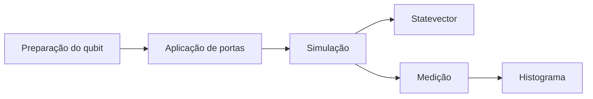

# Computação Quântica com Qiskit - Curso intensivo do Professor Nathan Lima

> **Coleção de notebooks** desenvolvidos para introduzir os fundamentos da Computação Quântica por meio do ecossistema **Qiskit**, conciliando fundamentação matemática, interpretação física e implementação computacional.

## Visão Geral

O material foi desenvolvido com foco educacional, explorando conceitos centrais como superposição, portas quânticas, Esfera de Bloch, vetores de estado, emaranhamento e protocolos elementares da informação quântica. Tudo isso foi feito ao longo do curso intensivo de computação quântica lecionada pelo professor Nathan Lima. 

---

# Objetivos

- Introduzir os fundamentos da Computação Quântica.
- Modelar circuitos utilizando **Qiskit**.
- Compreender a representação matemática dos qubits.
- Visualizar a evolução dos estados quânticos.
- Simular experimentos em ambiente clássico.
- Construir estados emaranhados e interpretar seus resultados.

---

# Tecnologias

| Tecnologia | Finalidade |
|------------|------------|
| Python 3 | Linguagem principal |
| Qiskit | Framework de Computação Quântica |
| Qiskit Aer | Simulações |
| NumPy | Álgebra Linear |
| Matplotlib | Visualizações |
| Google Colab | Ambiente de execução |

---

# Estrutura

```text
.
├── Aula_pratica_curso_imersivo.ipynb
├── Notebook_Hadamard_Esfera_Bloch.ipynb
├── Par_de_Bell_Qiskit_Google_Colab_CORRIGIDO.ipynb
└── README.md
```

---

# Fundamentação Teórica

## O qubit

Um qubit é descrito pelo vetor de estado

```text
|ψ⟩ = α|0⟩ + β|1⟩
```

em que

```text
|α|² + |β|² = 1
```

garante a normalização das probabilidades.

Diferentemente do bit clássico, o qubit pode permanecer em superposição até o instante da medição.

---

## Superposição

A superposição permite que um sistema quântico represente simultaneamente combinações lineares dos estados da base computacional.

Esse comportamento constitui um dos pilares da vantagem potencial da computação quântica.

---

## Porta Hadamard

A porta Hadamard cria superposição uniforme.

```text
        1
H = ───────── · [ 1   1 ]
      √2         [ 1  -1 ]
```

Aplicações fundamentais:

```text
H|0⟩ = (|0⟩ + |1⟩)/√2

H|1⟩ = (|0⟩ − |1⟩)/√2
```

Também verifica-se que

```text
H² = I
```

---

## Esfera de Bloch

A Esfera de Bloch representa geometricamente estados de um único qubit.

- Polo Norte → |0⟩
- Polo Sul → |1⟩
- Equador → superposições

O notebook correspondente utiliza as ferramentas gráficas do Qiskit para visualizar essas rotações.

---

## Vetor de Estado

Os notebooks empregam `Statevector` para inspecionar diretamente as amplitudes complexas produzidas pelos circuitos.

Essa abordagem permite compreender a evolução do sistema antes da medição.

---

## Simulação

A execução é realizada utilizando `AerSimulator`, permitindo:

- milhares de medições (*shots*);
- histogramas de frequências;
- validação estatística dos resultados.

---

## Estado de Bell

Partindo do estado

```text
|00⟩
```

e aplicando Hadamard seguida de CNOT, obtém-se

```text
|Φ⁺⟩ = (|00⟩ + |11⟩)/√2
```

Esse estado representa um dos quatro estados de Bell e constitui um exemplo clássico de emaranhamento máximo.

---

## Emaranhamento

O emaranhamento impede que cada qubit seja descrito independentemente.

Nos experimentos observa-se que apenas

```text
00
11
```

aparecem nas medições, evidenciando a correlação prevista teoricamente.

---

## Medição

Segundo a Regra de Born,

```text
P(i) = |αᵢ|²
```

As distribuições obtidas experimentalmente convergem para essas probabilidades conforme aumenta o número de medições.

---

## Superdense Coding

Os notebooks também introduzem o protocolo de Superdense Coding, demonstrando como um par previamente emaranhado possibilita transmitir dois bits clássicos por meio do envio físico de apenas um qubit.

---

# Conteúdo dos notebooks

## Aula Prática

- criação de circuitos;
- portas quânticas;
- medições;
- simulações;
- primeiros protocolos.

## Hadamard e Esfera de Bloch

- visualização geométrica;
- rotações;
- interpretação física;
- evolução do vetor de estado.

## Par de Bell

- construção do estado de Bell;
- porta CNOT;
- emaranhamento;
- histogramas;
- correlação quântica.

---

# Fluxo dos experimentos



---

# Competências Desenvolvidas

- Álgebra Linear aplicada;
- Programação científica em Python;
- Modelagem de circuitos quânticos;
- Simulação computacional;
- Interpretação probabilística;
- Utilização do Qiskit.

---

# Referências

- Michael A. Nielsen; Isaac L. Chuang. *Quantum Computation and Quantum Information*.
- IBM Quantum Documentation.
- Qiskit Documentation.
- John Preskill — *Lecture Notes on Quantum Computation*.
